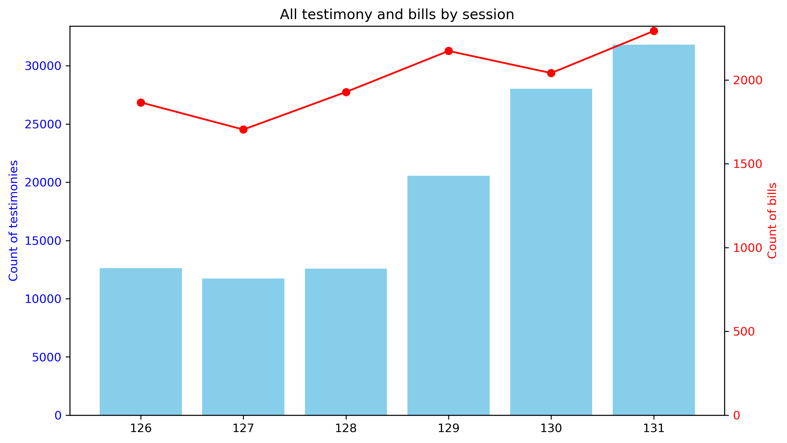
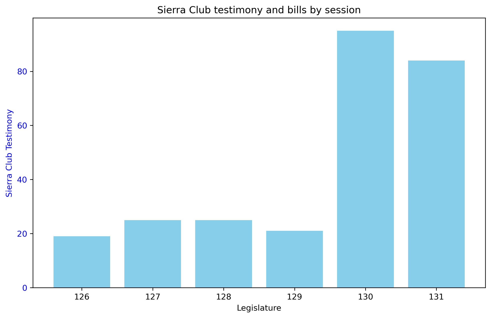
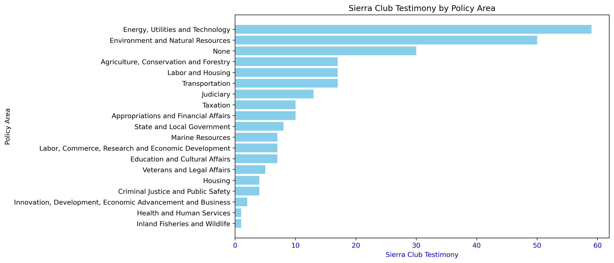

# Initial findings

Through initial profiling, I discovered some basic legislative testimony trends that were new to the stakeholder. In particular, this was enabled by extracting testimony information from a different legislative endpoint that included subject-matter labels for each bill.

Overall, bill and testimony volumes have increased from the 126th through the 131rd legislature, with testimony volumes increasing sharply.

This has also been the case for the stakeholder, the Sierra Club of Maine, where their testimony volumes rose sharply in the last two sessions. Clearly, this has become an increasing focus for the Sierra Club and speaks to their interest in better understanding patterns within legislative testimony. 

Investigation of the Sierra Club's specific testimony trends also highlighted how the organization names can vary and will require some condensation, which I plan to do with a separate grouping table that will associate various name patterns to a common string. 

Below is a sample of the different entities associated with the Sierra Club that have testified on bills, by Legislature.

|TESTIMONIES|LEGISLATURE|ORG_NAMES|
|-----------|-----------|---------|
|19|126|Sierra Club|
|25|127|Sierra Club,Maine Lobstering Union/Sierra Club,Sierra Club Maine Chapter|
|25|128|Sierra Club,Sierra Club Maine Chapter,Sierra Club Maine,Sierra Club of Maine|
|21|129|Sierra Club Maine,Sierra Club,Sierra Club Maine Energy Team,Maine Rail Transit Coalition and Sierra Club Maine,Sierra Club Maine Chapter|
|95|130|Sierra Club Maine Chapter,Sierra Club Maine,Sierra Club Energy Team,Sierra Club Maine Energy Team,Sierra Club Maine chapter,SierraClub,Sierra Club, Maine,Sierra Club,Sierra Club of Maine|
|84|131|Sierra Club Maine,Sierra Club Maine Chapter,Sierra Club of Maine,Sierra Club, Maine,Sierra Club|

At first glance, the Legislature's categorization of bills by topic does appear to align with the Sierra Club's general priorities, though there are a number of bills that are not categorized, though this data is not missing at random -- most is tied to the 126th Legislature, the first year for which testimony is available through this particular endpoint. 

